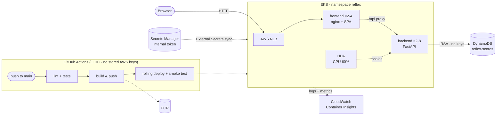

# ⚡ Reflex Arena

[](https://github.com/ahmed972890/reflex-arena/actions/workflows/pipeline.yml)

A small production-ready web game: test your reaction time over 5 rounds and fight for a spot
on the global leaderboard. Built as a take-home exercise to demonstrate **containerization,
CI/CD, cloud deployment on Kubernetes, observability, and autoscaling under load**.

- **Frontend** — React (Vite), served by unprivileged nginx which also proxies `/api`
- **Backend** — Python / FastAPI, stateless, Prometheus-instrumented
- **Data** — DynamoDB (single-table, conditional writes keep one personal-best row per player)
- **Platform** — AWS EKS, provisioned by Terraform, deployed by GitHub Actions via OIDC

---

## Architecture



Key properties:

- **No static credentials anywhere.** CI assumes an AWS role via GitHub OIDC; pods reach
  DynamoDB via IRSA (IAM Roles for Service Accounts). There is no AWS key in GitHub, in the
  cluster, or in this repo.
- **Only the frontend is public — the backend is triple-isolated.** It's a ClusterIP service
  (no external route), a NetworkPolicy admits only frontend pods, and every `/api` request
  must carry an internal token that nginx injects — direct calls get a 401. The token lives
  in **AWS Secrets Manager** and is synced into the cluster by the **External Secrets
  Operator**; it never appears in the repo, CI, or manifests.
- **Zero-downtime deploys.** Rolling updates with `maxUnavailable: 0` gated by readiness
  probes, plus PodDisruptionBudgets.
- **Immutable releases.** Every deploy pins images to the git SHA that produced them.

Repo map: `backend/` · `frontend/` · `k8s/` (kustomize) · `infra/` (Terraform) ·
`loadtest/` (k6) · `.github/workflows/` · `docs/` ([decisions](docs/DECISIONS.md),
[runbook](docs/RUNBOOK.md))

---

## Run it locally

Requires Docker. The full stack (frontend + backend + DynamoDB Local) runs in containers:

```bash
make dev          # → http://localhost:3000  (API docs: http://localhost:8000/docs)
make logs         # tail everything
make dev-down     # stop and clean up
```

If port 3000 is busy: `cp .env.example .env` and change `FRONTEND_PORT`.

Tests and lint (backend, uses [uv](https://github.com/astral-sh/uv)):

```bash
make venv         # once
make test         # pytest (DynamoDB mocked with moto — no Docker needed)
make lint
```

Quick local load check: `make smoke-local` (30s k6 run, needs `brew install k6`).

---

## Deploy to AWS — from zero to public URL

> ⚠️ Use a **personal** AWS account. Everything lands in `eu-west-3` by default and costs
> **≈ $4–5/day** while running (EKS control plane + 2×t3.small + NLB). Tear down with
> `make down-cloud` when you're done.

**0. Tools** — `asdf install` in the repo root installs the pinned `terraform`, `awscli`,
`kubectl` (see `.tool-versions`). Verify identity: `aws sts get-caller-identity`.

**1. Provision the infrastructure** (~15–20 min, mostly EKS):

```bash
make tf-init    # bootstraps remote state (S3 + DynamoDB lock table), then terraform init
make tf-apply
```

Terraform state lives in a versioned, encrypted S3 bucket with DynamoDB locking
(`scripts/bootstrap-state.sh` creates both, idempotently). The apply creates: VPC, EKS
cluster + managed node group, ECR repos, the DynamoDB table, CloudWatch Container Insights,
External Secrets Operator, the Secrets Manager secret, IRSA roles, and the **GitHub deploy
role**.

> Already have the GitHub OIDC provider in the account? Apply with
> `-var create_github_oidc_provider=false`.

**2. Create the GitHub repo and wire the pipeline.** The repo **must** be named
`<your-user>/reflex-arena` (or change `github_repository` in `infra/variables.tf` first —
the OIDC trust policy is bound to that exact repo + `main` branch):

```bash
gh repo create reflex-arena --public --source . --push
gh variable set AWS_ROLE_ARN --body "$(terraform -chdir=infra output -raw github_deploy_role_arn)"
```

(Optional: `AWS_REGION` and `EKS_CLUSTER_NAME` variables if you changed the defaults.)

**3. Ship.** The push in step 2 already triggered the pipeline: tests → image build & push
to ECR → rolling deploy → smoke test. Watch it with `gh run watch`. Then:

```bash
make kubeconfig   # point kubectl at the cluster
make url          # → http://<nlb-hostname>  ← the public URL
```

The URL also appears in the Actions run summary and on the repo's `production` environment.

---

## Load & scaling demo

The system autoscales on CPU: the backend HPA holds 2 replicas and scales to 8 when average
utilization crosses 60%. To demonstrate (three terminals):

```bash
# T1 — live replica/CPU view
make watch-scaling

# T2 — traffic: 1m ramp → steady 30 VUs → spike to 150 VUs → sustained peak → cooldown
make loadtest URL=$(make -s url)

# T3 (optional, during the peak) — reliability under failure:
make chaos        # kills a random backend pod; error rate stays ~0
```

What to expect: k6 holds p95 latency under its 800 ms threshold and <1% errors; the HPA
scales the backend out within ~1–2 minutes of the spike and scales back ~2 minutes after
cooldown. CloudWatch → Container Insights shows the same story (per-pod CPU, replica count),
and `reflex` pod logs are queryable in CloudWatch Logs Insights.

**How it scales further** (documented, not implemented — see [DECISIONS](docs/DECISIONS.md)):
Cluster Autoscaler/Karpenter for node-level elasticity; DynamoDB is already on-demand;
write-sharding the leaderboard partition beyond ~1k writes/s; CloudFront in front of the NLB
for TLS + edge caching of the static bundle.

## Reliability

- 2+ replicas per tier, spread across nodes (pod anti-affinity) and protected by PDBs
- Readiness (`/readyz`, checks DynamoDB) gates traffic; liveness (`/healthz`) restarts hung pods
- Rolling updates never drop below full capacity; `preStop` drains in-flight requests
- Adaptive retries with backoff on all DynamoDB calls; graceful SIGTERM shutdown
- Drill it live: `make chaos` mid-load-test — the Service routes around the dying pod

## Observability

- **Structured JSON logs** with request IDs propagated from nginx → FastAPI (`x-request-id`
  on every response). Query in CloudWatch Logs Insights:

  ```
  fields ts, message, method, path, status, duration_ms, request_id
  | filter kubernetes.namespace_name = "reflex" | sort ts desc | limit 50
  ```

- **Metrics**: Container Insights (CPU, memory, replica counts, restarts) out of the box;
  the backend also exposes Prometheus metrics on `/metrics` (request rate/latency/status,
  scores submitted) — cluster-internal, ready for a Prometheus stack.
- **Health**: `/healthz` (liveness), `/readyz` (readiness incl. datastore), used by probes,
  compose, and the pipeline's post-deploy smoke test.

## Security

- GitHub OIDC → short-lived AWS credentials, trust locked to this repo's `main` branch
- IRSA gives the backend **only** `PutItem/GetItem/UpdateItem/Query/DescribeTable` on the one table
- CI's kubernetes rights are namespace-scoped via EKS access entries (no `aws-auth` edits)
- **Secrets**: the internal service token is generated by Terraform, stored in AWS Secrets
  Manager, and synced in-cluster by External Secrets (IRSA-scoped to that one secret).
  Nothing sensitive in the repo, GitHub, or manifests
- **Backend isolation, three layers**: ClusterIP only + NetworkPolicy (frontend pods only,
  enforced by the VPC CNI agent) + per-request internal token checked with a constant-time
  compare (`hmac.compare_digest`)
- Containers: non-root, read-only root filesystem, all capabilities dropped, seccomp default
- Same-origin API (no CORS surface); strict server-side input validation; security headers +
  CSP on the frontend; ECR scans on push
- Terraform state (which contains the token) sits in a private, encrypted, versioned S3 bucket

## Costs & teardown

| Item | ~cost/day |
|---|---|
| EKS control plane | $2.40 |
| 2 × t3.small nodes | $1.15 |
| NLB | $0.65 |
| DynamoDB (on-demand) + CloudWatch + ECR + Secrets Manager + S3 state | ~$0.15 at demo volume |
| **Total** | **≈ $4.30/day** |

```bash
make down-cloud   # deletes k8s workloads first (releases the NLB), then terraform destroy
```

> Don't run `terraform destroy` alone while the app is deployed: the NLB was created by the
> Kubernetes Service, Terraform doesn't know it, and the VPC teardown will hang until the
> Service is deleted.

## Honest limitations & next steps

- **No TLS/domain** — the NLB hostname is plain HTTP. Next: Route 53 + ACM + AWS Load
  Balancer Controller (ALB Ingress), or CloudFront in front.
- **No auth / rate limiting** — fine for a demo game; a real API would add both (e.g. per-IP
  limits at the edge).
- **Terraform runs locally with local state** — next: S3 backend + a plan/apply pipeline.
- **Nodes in public subnets** (cost tradeoff, documented) — production: private subnets + NAT.
- **Pod density caps scale-out at ~6 backend replicas**: t3.small allows 11 pods/node (ENI/IP
  limits) and system pods eat about half. Measured under load (`Too many pods` scheduling
  events at HPA max 8). Remedies: VPC CNI prefix delegation, larger instances, or
  Karpenter/Cluster Autoscaler adding nodes.
- Prometheus + Grafana instead of relying on Container Insights; SLO alerts; canary deploys.

Key technical decisions with tradeoffs: **[docs/DECISIONS.md](docs/DECISIONS.md)** ·
Operations: **[docs/RUNBOOK.md](docs/RUNBOOK.md)**
